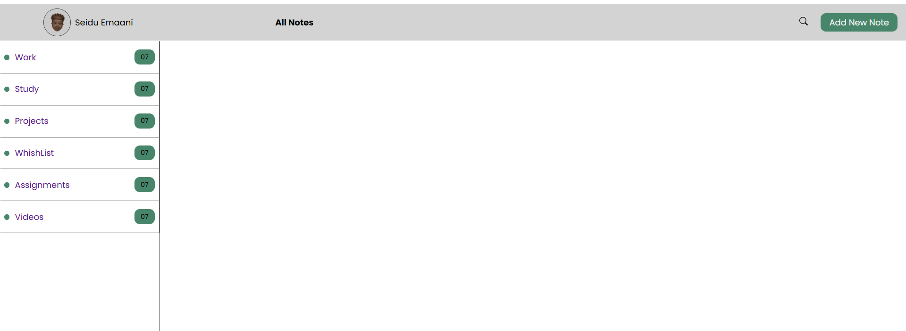
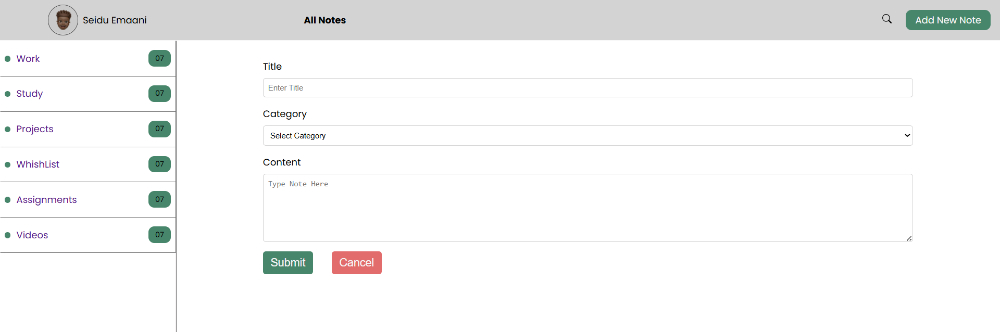

# Note Taking App

## MOTIVE

To help users capture, organize, and access their thoughts, tasks, and ideas anytime, anywhere—enhancing productivity and ensuring nothing important is ever forgotten.

## TECH STACK

## SETUP ENV

First setup .env file as seen in the example below for the api:

1. DB_USERNAME
2. DB_PORT
3. DB_PASS
4. DB_NAME
5. DB_HOST
6. DB_DIALET

Start Backend note-api (https://github.com/Emaani-gh/note-api)

-npm install to install dependencies
-npm start to start app

Start Fronted

-npm start to run project

## SCREENSHOTS

